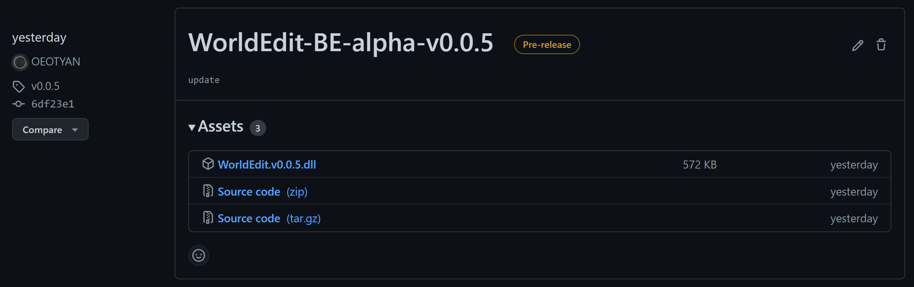

# 安装与使用

## **阅读并同意免责声明**

::: danger 免责声明
&emsp;&emsp;您首先需要明确：**开发者与您并不存在任何人身依附关系，您无理由更无权要求开发者做任何事情，开发者对本项目及其附属所造成的后果不承担任何责任或连带责任。**

使用本插件所带来的可能性后果**包括但不限于**：

- 方块错误
- 方块实体丢失
- 生物消失
- 生物信息错误
- 生物群系错误
- 聊天信息错误
- 后台输出错误
- 区块丢失
- 服务器崩溃
- 游戏崩溃
- 系统崩溃
- 存档损坏

&emsp;&emsp;即使您在使用本插件时发生了任何您认为不应当发生的问题，您也无权向开发者追责，即使您日后去除插件也不一定保证问题不再发生，即使您从未安装过此插件也无法保证上述问题不会发生。

&emsp;&emsp;如果您使用了 WorldEdit-BE 就意味着您**自动同意**了该声明。即使您并未使用 WorldEdit-BE 也不意味着您没有同意该声明，不允许以您所在的服同意了该声明而您自身并未同意该声明为理由向开发者追责。当服务器装载 WorldEdit-BE 时便**视为服内成员一致同意**该声明。如有疑问，一切问题皆由装载该插件的管理人员与服务器所属者共同承担责任。
:::

## **下载与使用 BDS**

&emsp;&emsp;请参考 [TrapDoor wiki](https://hhhxiao.github.io/tr-wiki/use.html)
::: center

:::

## **下载与使用 LiteLoader**

&emsp;&emsp;本插件的使用需要依赖于 [`LiteLoader`](https://github.com/LiteLDev/LiteLoaderBDS/blob/main/README_zh-cn.md) ，一款是一个非官方的 Minecraft 服务端插件加载器。你需要先安装此加载器才可使用 WorldEdit-BE 。

## **下载并安装插件本体**

&emsp;&emsp;在此之前，请确保你已经安装好 `LiteLoader` 。之后，前往[WorldEdit-BE 的下载页面](https://github.com/OEOTYAN/WorldEdit-BE/releases)下载最新版本的文件。
下图展示了下载页面：
::: center

:::

&emsp;&emsp;可以看到，通常需要下载的是一个 `.zip` 文件，你需要将其解压，并将其中的文件放置于 plugins 文件夹：

```txt
└───bedrock-server-xxx (服务器文件夹)
  └───plugins
    └───WorldEdit.dll
    └───WorldEdit
```

## **下载并安装客户端用户界面**

&emsp;&emsp;当你尝试使用该插件时，会发现选框没有被显示出来，这通常是因为你没有安装客户端用户界面。在 [LiteLoaderBDS-CUI 的下载页面](https://github.com/OEOTYAN/LiteLoaderBDS-CUI/releases)下载最新版本的 `.mcpack` 资源包文件并安装到游戏内，以全局资源的方式加载资源包。
